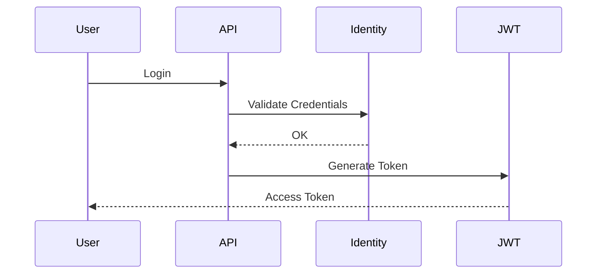

# Autenticação

A autenticação utiliza JWT Bearer.

Fluxo:

Após autenticado, o usuário envia:

Authorization: Bearer {token}

Todas as requisições protegidas passam pelo middleware JWT antes de chegar aos Controllers.
