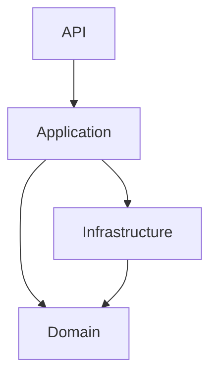
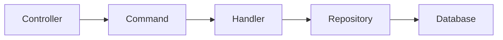

# Diagramas

## Clean Architecture



---

## CQRS



---

## Domain Events

```mermaid
flowchart TD

Entity

Raise Event

UnitOfWork

Mediator

Handler

Entity --> Raise Event

Raise Event --> UnitOfWork

UnitOfWork --> Mediator

Mediator --> Handler
```
