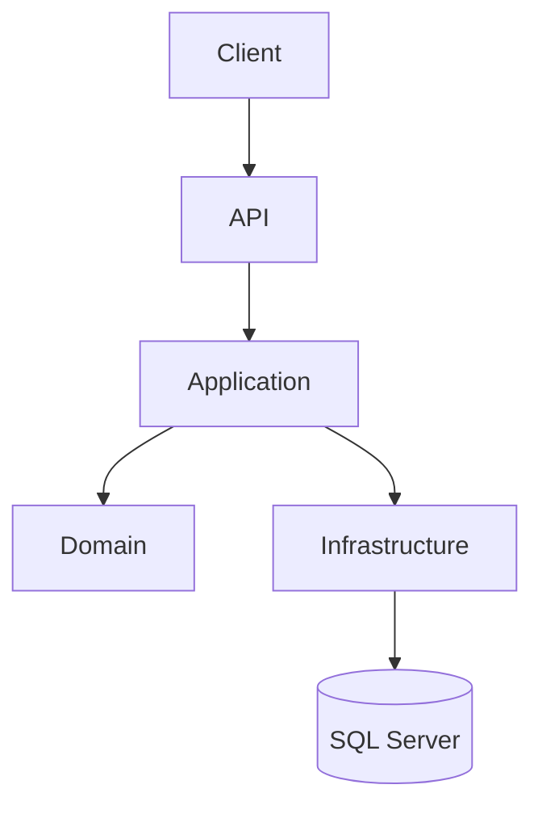

# Visão Geral da Arquitetura

## Introdução

O YFCore Backend foi desenvolvido utilizando os princípios da Clean Architecture aliados ao Domain-Driven Design (DDD), buscando separar responsabilidades, reduzir acoplamento e facilitar a evolução do sistema.

A arquitetura permite que as regras de negócio permaneçam independentes de frameworks, banco de dados e detalhes de infraestrutura.

---

## Objetivos

- Isolar regras de negócio
- Facilitar testes
- Facilitar manutenção
- Permitir substituição de tecnologias
- Escalabilidade
- Alta coesão
- Baixo acoplamento

---

## Arquitetura Geral



---

## Camadas

### API

Responsável pela comunicação HTTP.

Responsabilidades:

- Controllers
- Middleware
- Autenticação
- Swagger
- Dependency Injection

---

### Application

Responsável pelos casos de uso.

Contém:

- Commands
- Queries
- Handlers
- DTOs
- Validators
- Interfaces

---

### Domain

É o coração do sistema.

Contém:

- Entidades
- Value Objects
- Agregados
- Domain Events
- Exceções
- Interfaces de Repositório

Não possui dependência de frameworks.

---

### Infrastructure

Implementa os contratos definidos pelo domínio.

Contém:

- EF Core
- Repositories
- DbContext
- Migrations
- Identity
- JWT

---

## Fluxo

```text
HTTP

↓

Controller

↓

Command

↓

Handler

↓

Domain

↓

Repository

↓

EF Core

↓

SQL Server
```

---

## Dependências

A regra mais importante da arquitetura é:

As dependências sempre apontam para o centro.

Infrastructure → Domain

API → Application

Application → Domain

Nunca o contrário.
