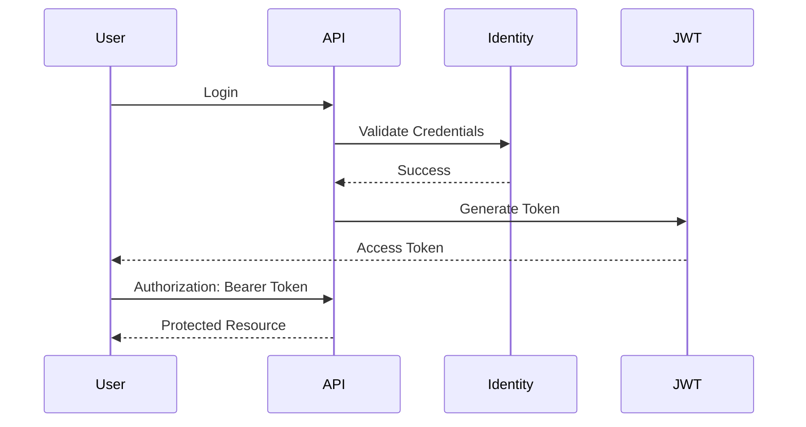

# Autenticação JWT

```mermaid
sequenceDiagram

participant User

participant API

participant Identity

participant JWT

User->>API: Login

API->>Identity: Validate Credentials

Identity-->>API: Success

API->>JWT: Generate Token

JWT-->>User: Access Token

User->>API: Authorization: Bearer Token

API-->>User: Protected Resource
```