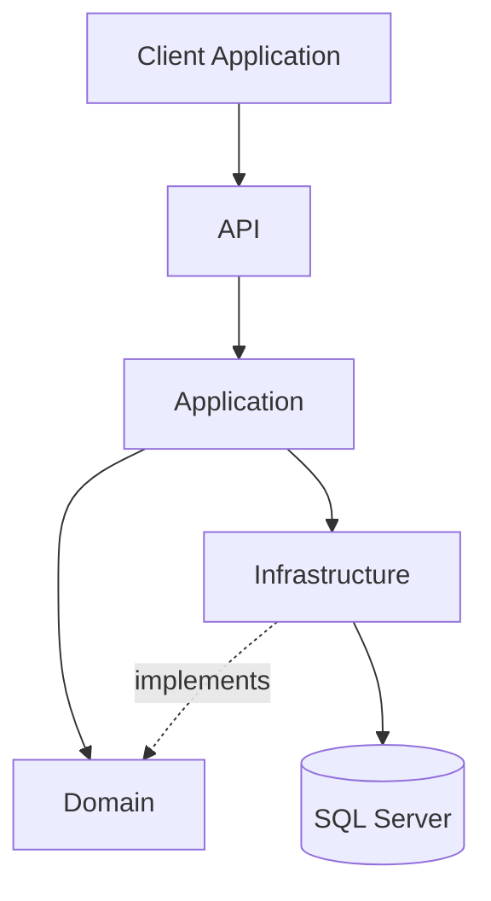

# Clean Architecture

## Descrição

A arquitetura é organizada em camadas.

As regras de negócio permanecem no centro da aplicação (Domain), enquanto detalhes técnicos permanecem na Infrastructure.

As dependências sempre apontam para dentro.