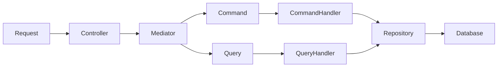

# CQRS

```mermaid
flowchart LR

Request

Controller

Mediator

Command

Query

CommandHandler

QueryHandler

Repository

Database

Request --> Controller

Controller --> Mediator

Mediator --> Command

Mediator --> Query

Command --> CommandHandler

Query --> QueryHandler

CommandHandler --> Repository

QueryHandler --> Repository

Repository --> Database
```

Commands alteram o estado da aplicação.

Queries apenas consultam dados.