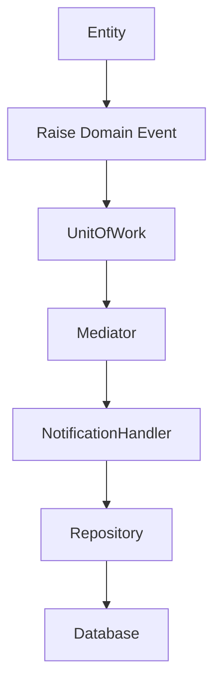

# Domain Events

```mermaid
flowchart TD

Entity

RaiseEvent["Raise Domain Event"]

UnitOfWork

Mediator

NotificationHandler

Repository

Database

Entity --> RaiseEvent

RaiseEvent --> UnitOfWork

UnitOfWork --> Mediator

Mediator --> NotificationHandler

NotificationHandler --> Repository

Repository --> Database
```

Os eventos de domínio permitem desacoplar comportamentos relacionados ao domínio sem criar dependências diretas entre entidades.