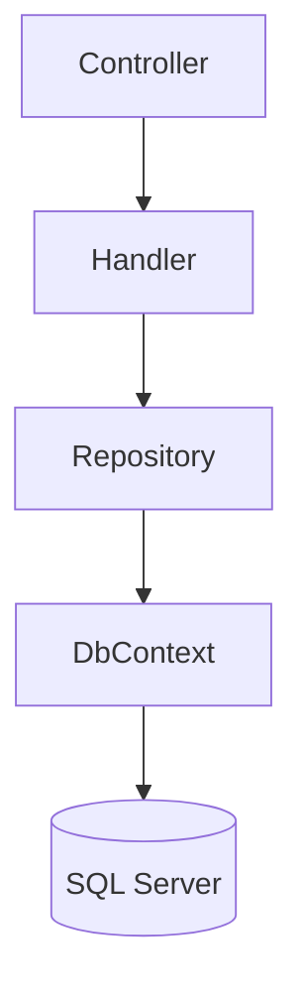

# Persistência

```mermaid
flowchart TD

Controller

Handler

Repository

DbContext

SQL[(SQL Server)]

Controller --> Handler

Handler --> Repository

Repository --> DbContext

DbContext --> SQL
```

A camada Application nunca acessa diretamente o Entity Framework Core.

Toda persistência ocorre através das abstrações definidas no domínio.